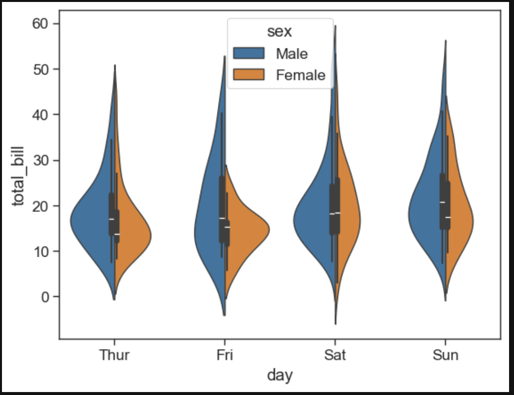

# Seaborn Readme
---

## Data Setup

```python
# You can import custom data
df = pd.read_csv('ComputerSales.csv')
crash_df = sns.load_dataset("car_crashes")
```

---

## Distribution plot

```python
sns.displot(crash_df['not_distracted'], kde = True, bins =10)
```

**How to create it:** Pass a single numerical Series to `sns.displot`, choose the number of `bins`, and set `kde=True` to overlay a smooth density curve.

**Why data scientists use it:** Distribution plots reveal the shape of a variable (center, spread, skewness, tails, outliers) at a glance, which guides preprocessing choices like transformations, outlier handling, and binning. Understanding marginal distributions is foundational for selecting appropriate models, detecting data entry errors, and interpreting results—e.g., a heavy right tail may suggest using robust metrics or log transforms, while multimodality may indicate latent subgroups worth modeling separately.


---

## Joint plot

```python
sns.jointplot(x='speeding', y= 'alcohol', data= crash_df, kind = 'reg')
```

**How to create it:** Provide `x`, `y`, and `data` to `sns.jointplot`; set `kind='reg'` to add a regression line and marginal histograms/densities.

**Why data scientists use it:** Joint plots simultaneously show a bivariate relationship and each variable’s distribution, making it easy to assess linear trends, spread, and potential outliers. The regression fit offers a quick visual check of correlation direction and strength, while the marginals reveal whether relationships are driven by unusual values or by dominant ranges—useful for feature engineering, model diagnostics, and early hypothesis checking.


---

## KDE plot

```python
sns.kdeplot(crash_df['alcohol'])
```

**How to create it:** Pass a numeric Series to `sns.kdeplot` to draw a kernel density estimate—a smoothed version of a histogram.

**Why data scientists use it:** KDEs provide a smooth estimate of the probability density, helping analysts compare distributions without bin-size artifacts. They are especially useful for spotting subtle features (e.g., multiple peaks) and for overlaying several groups to compare continuous variables, informing transformations, thresholds, and the selection of statistical tests.


---

## Pair plot (tips, with hue)

```python
#sns.pairplot(crash_df)

tips_df = sns.load_dataset('tips')
tips_df

sns.pairplot(tips_df, hue = 'sex', palette= 'Blues')
```

**How to create it:** Use `sns.pairplot` on a DataFrame to plot every pairwise combination of numeric columns; set `hue` to color by a category and `palette` for the color scheme.

**Why data scientists use it:** Pair plots offer a compact overview of relationships among multiple variables, revealing correlations, nonlinearities, clusters, and outliers across many pairings at once. Coloring by a category exposes group differences and interactions, helping prioritize features, detect collinearity, and form early hypotheses about which variables drive outcomes.


---

## Rug plot

```python
sns.rugplot(tips_df['tip'])
```

**How to create it:** Provide a 1D numeric vector; `rugplot` draws small ticks along the axis where observations occur, often combined with hist/KDE.

**Why data scientists use it:** Rug plots show the exact data support (where points lie) without aggregation, highlighting gaps, clusters, and repeated values. They complement histograms and KDEs to ensure smoothing or binning didn’t hide sparse regions or outliers—a quick check to avoid misleading summaries.


---

## Styling (context, ticks, despine)

```python
sns.set_style('ticks')

plt.figure(figsize=(8,4))

#paper, talk, poster

sns.set_context('paper', font_scale=1.4)
sns.jointplot(x='speeding', y = 'alcohol', data = crash_df, kind = 'reg')

sns.despine(left=True, bottom=True)
```

**How to create it:** Use `sns.set_style` and `sns.set_context` to control gridlines, fonts, and element scaling; `sns.despine` removes top/right (or chosen) spines for a cleaner look.

**Why data scientists use it:** Consistent styling improves readability and comparability across plots, especially in reports and papers where font sizes and line weights must match the medium (slides vs. print). Clean, well-proportioned visuals reduce cognitive load, help stakeholders focus on insights, and communicate results more persuasively.


---

## Bar plot

```python
sns.barplot(x='sex', y = 'total_bill', data=tips_df, estimator = np.cov)
```

**How to create it:** Give a categorical `x` and numeric `y`; `estimator` aggregates `y` within each category (here, `np.cov` as provided).

**Why data scientists use it:** Bar plots summarize central tendency (often mean/median) across categories with confidence intervals, making comparisons straightforward. They’re useful for showing group differences, tracking KPI changes across segments, and communicating effect sizes when precise distributions are less critical.


---

## Count plot

```python
sns.countplot(x='sex', data = tips_df, hue = 'sex')
```

**How to create it:** With `countplot`, pass a categorical variable to count its occurrences; `hue` splits counts by a secondary category.

**Why data scientists use it:** Count plots expose class imbalance and sample composition—key for model training (e.g., rebalancing, weighted loss) and fair evaluation. They quickly answer “how many per group?” and surface data collection biases that might skew downstream analyses.


---

## Boxplot

```python
sns.boxplot(x='day', y= 'total_bill', data = tips_df, hue = 'sex')

plt.legend(loc=0)
```

**How to create it:** Supply a categorical `x` and numeric `y`; `hue` adds subgroup comparisons; adjust legend placement with Matplotlib.

**Why data scientists use it:** Boxplots summarize distributions via median and quartiles while flagging potential outliers. They’re ideal for robust comparisons across many groups, helping identify shifts in central tendency, variability, and anomalies that might require cleaning or model-robust approaches.


---

## Violin plot

```python
sns.violinplot(x='day', y='total_bill', data=tips_df, hue='sex', split = 'True')
```

**How to create it:** Provide categorical `x` and numeric `y`; `hue` splits by subgroup; `split=True` (boolean) overlays distributions for direct comparison.

**Why data scientists use it:** Violin plots show full distribution shapes (not just quartiles), revealing multimodality and tail behavior. They’re great when you need more detail than a boxplot provides, supporting decisions about transformations, thresholds, and whether group differences are localized or global.



---

## Strip plot

```python
plt.figure(figsize=(8,5))
strip plot:
sns.stripplot(x='day', y='total_bill',
data= tips_df, hue='sex', jitter=True, dodge= True)
```

**How to create it:** Use `sns.stripplot` for individual points; `jitter=True` reduces overplotting and `dodge=True` separates hue groups side-by-side.

**Why data scientists use it:** Strip plots show every observation, making them ideal for small/medium datasets where transparency is important. They help spot outliers, overlaps, and sample sizes per group, complementing summary charts to prevent “summary-only” blind spots.


---

## Swarm plot

```python
swarm plot:
sns.swarmplot(x='day', y='total_bill', data=tips_df, hue = 'day')
```

**How to create it:** `sns.swarmplot` packs points to avoid overlap, preserving exact values while showing density via stacking.

**Why data scientists use it:** Swarm plots provide a distribution-aware view of raw data that’s easier to read than jittered points alone. They’re useful for showcasing small-group variation, validating summary statistics, and communicating results to non-technical audiences who benefit from seeing actual observations.


---

## Palettes & context (styled strip plot)

```python
plt.figure(figsize=(8,6))

sns.set_style('dark')
sns.set_context('talk')
sns.stripplot(x='day', y ='total_bill',
              data = tips_df, hue = 'sex',palette = 'magma')
plt.legend(loc=0)
```

**How to create it:** Adjust global style and context, then choose a `palette` for categorical hues; the legend indicates group colors.

**Why data scientists use it:** Color palettes and context scaling improve accessibility and clarity, enabling consistent branding and highlighting important categories. Good color choices avoid misinterpretation (e.g., red/green for colorblind audiences) and make dashboards/reports more legible.


---

## Heatmap (correlation)

```python
plt.figure(figsize=(8,6))

sns.set_context('paper', font_scale = 1.4)

crash_mx = crash_df.corr()
sns.heatmap(crash_mx, annot=True, cmap='Blues')
```

**How to create it:** Compute a numeric correlation matrix (e.g., `df.corr()`), then pass it to `sns.heatmap`; `annot=True` writes correlation values in each cell.

**Why data scientists use it:** Correlation heatmaps reveal linear relationships and collinearity, guiding feature selection, regularization strategy, and interpretation. Blocks of high correlation can indicate redundant features or shared latent factors; negative correlations suggest tradeoffs and can motivate engineered features or domain questions.


---

## Modified heatmap (pivoted flights)

```python
flights = sns.load_dataset('flights')
flights = flights.pivot_table(index='month', columns='year', values = 'passengers')
sns.heatmap(flights, cmap='Blues', linecolor='white', linewidth=1)
```

**How to create it:** Reshape long data into a matrix with `pivot_table` and feed to `sns.heatmap`; gridlines (`linecolor`, `linewidth`) improve readability.

**Why data scientists use it:** Pivoted heatmaps are powerful for time-series matrices and panel data, quickly revealing seasonality, growth, or anomalies across categories and time. They support exploratory analysis, capacity planning, and monitoring in a compact visual.


---

## Clustermap

```python
"""
iris = sns.load_dataset('iris')
species = iris.pop('species')
sns.clustermap(iris)
"""

sns.clustermap(flights, cmap='Blues', standard_scale=1)
```

**How to create it:** Pass a numeric matrix/DataFrame to `sns.clustermap`; it standardizes (optional) and performs hierarchical clustering to reorder rows/columns by similarity.

**Why data scientists use it:** Clustermaps uncover latent structure—groups of similar features or samples—without labels. They’re valuable for segmenting customers, grouping correlated signals, spotting co-movement in time series, and generating hypotheses about underlying mechanisms.


---

## PairGrid (custom pair selection)

```python
iris = sns.load_dataset('iris')
#iris_g = sns.PairGrid(iris, hue='species')
#iris_g.map(plt.scatter)
#iris_g.map_diag(plt.hist)
#iris_g.map_offdiag(plt.scatter)
#iris_g.map_upper(plt.scatter)
#iris_g.map_lower(sns.kdeplot)

iris_g = sns.PairGrid(iris, hue="species", x_vars = ['sepal_length','sepal_width'],
                      y_vars =['petal_length', 'petal_width'])
iris_g.map(sns.scatterplot, s=35, alpha=0.8)
iris_g.add_legend()
```

**How to create it:** Build a `PairGrid` for fine-grained control of which variables appear on rows/columns; map different plotting functions to diagonal/off-diagonal or specify exact variables.

**Why data scientists use it:** `PairGrid` provides flexibility beyond `pairplot`, letting analysts tailor comparisons to specific hypotheses or presentation needs. It’s ideal for focusing on the most relevant feature interactions and applying custom mappings or annotations.


---

## FacetGrid (small multiples)

```python
"""
tips_fg = sns.FacetGrid(tips_df, col = 'time', hue='smoker', height = 4, aspect=1.3,
                       col_order=['Dinner', 'Lunch'])
tips_fg.map(plt.scatter, 'total_bill', 'tip', edgecolor = 'w')
"""

"""
kws = dict(s=50, linewidth=.5, edgecolor='w')
tips_fg = sns.FacetGrid(tips_df, col='sex', hue='smoker', height=4, aspect=1.3,
                       hue_order=['Yes', 'No'],
                       hue_kws=dict(marker=['^','v']))
tips_fg.map(plt.scatter, 'total_bill', 'tip', **kws)
"""

att_df = sns.load_dataset('attention')
att_fg = sns.FacetGrid(att_df, col = 'subject', col_wrap=5,height=1.5)
att_fg.map(plt.plot, 'solutions', 'score', marker='.')
```

**How to create it:** Use `FacetGrid` to split data into small multiples by categories (`row`, `col`, `hue`) and map a plotting function to each facet.

**Why data scientists use it:** Small multiples enable clean comparisons across segments (time, groups, conditions) without clutter. They help detect interactions and heterogeneous effects—critical for robust conclusions, fair models, and targeted interventions.


---

## Regression plots (lmplot)

```python

tips_df.head()

plt.figure(figsize=(8,6))
sns.set_context('paper', font_scale=1.4)
sns.lmplot(x='total_bill', y = 'tip', hue='sex', data=tips_df, markers= ['o', '^'],
           scatter_kws={'s':100,'linewidths':0.5, 'edgecolor':'w'})
```

**How to create it:** Call `sns.lmplot` with `x`, `y`, and optional `hue`; customize markers and `scatter_kws` for readability. It fits and draws a regression line with confidence interval.

**Why data scientists use it:** Regression plots visualize linear relationships, effect sizes, and uncertainty, supporting quick sanity checks before formal modeling. They aid communication by connecting raw data to a simple model—useful for explaining trends, residual patterns, and subgroup differences.


---

## Another regression (faceted lmplot)

```python
sns.lmplot(x='total_bill', y = 'tip', col = 'sex', row = 'time', data=tips_df)
```

**How to create it:** Add `col`/`row` to `lmplot` to facet the regression across categories, fitting separate lines per facet.

**Why data scientists use it:** Faceted regressions reveal whether relationships vary by subgroup (interaction effects). This is crucial for fair modeling, targeted strategies, and avoiding misleading averages—what’s true overall may differ substantially within segments.


